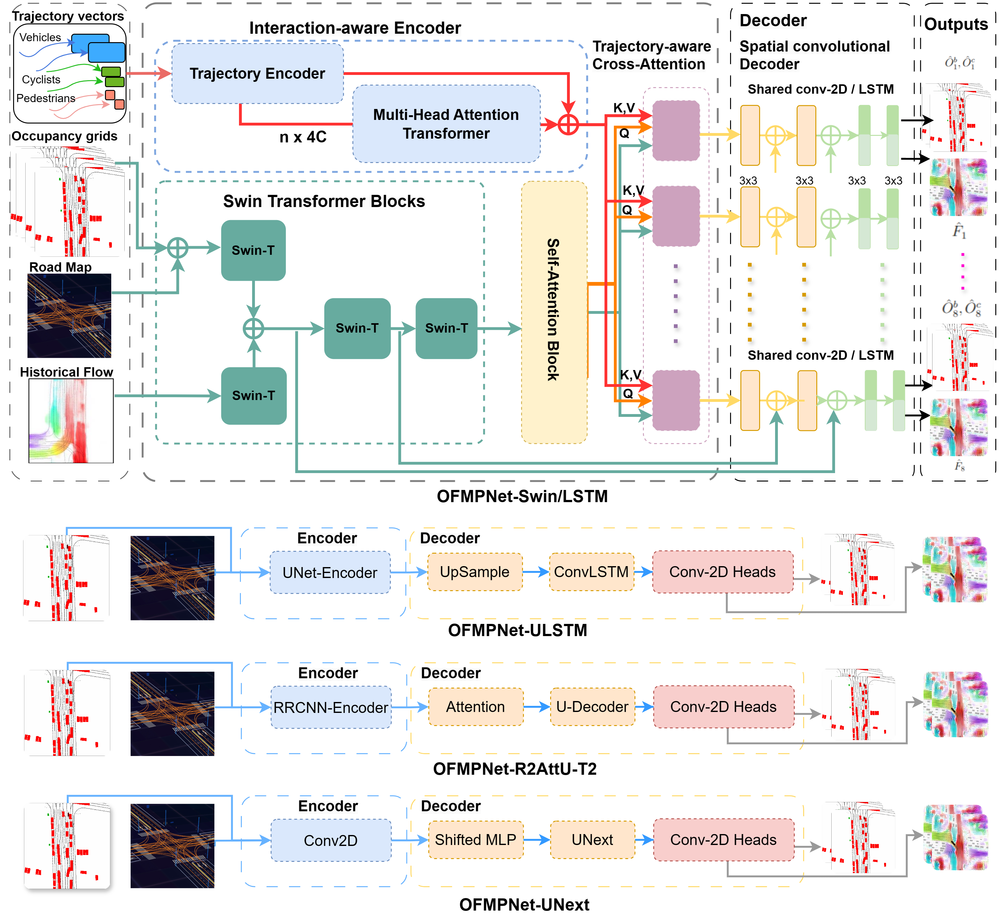

# OFMPNet: Deep End-to-End Model for Occupancy and Flow Prediction in Urban Environment
  [](https://opensource.org/licenses/MIT) 

Another Multi-modal End-to-end pipeline for Occupancy Flow Field and Motion Prediction

Paper link will be added soon!
## Model Architecture:


## Abstract:
Motion prediction task is essential for autonomous driving systems and provides the necessary information required to plan a vehicle's behaviour in the environment. 
Current motion prediction methods focus on predicting the future trajectory for each agent in the scene separately using its previous trajectory information. 
In this article, we propose an end-to-end neural network method to predict all future behaviours for dynamic objects in the environment benefiting from the occupancy map and the motion flow of the scene. 
We are exploring various options for building a deep encoder-decoder model called OFMPNet, which takes as input a sequence of bird's-eye-view images with a road map, occupancy grid, and previous motion flow. 
The model encoder can contain transformer, attention-based or convolutional units. 
The decoder considers the usage of both convolutional modules and recurrent blocks. 
We also proposed a novel time-weighted motion flow loss, the application of which demonstrated a significant reduction in end-point error. 
On Waymo Occupancy and Flow Prediction benchmark, our approach achieved state-of-the-art results with 52.1\% Soft IoU and 76.75\% AUC on Flow-Grounded Occupancy.

## Main results:

|     Metrics    | Observed Occupancy | Occluded Occupancy  | 	Flow	 | Flow-Grounded Occupancy | 
| :-----------:  | :-----------:      | :-----------:       |:----------:| :-----------:           |

| Model          | AUC           | 	Soft IoU     | AUC           |	Soft IoU     |	EPE          | AUC           | 	Soft IoU    |
| :------------: |:------------: | :-----------: | :-----------: |:------------: | :-----------: | :-----------: |:-----------: |
|    OFMPNet-R2AttU   |      0.4726 |    0.2028  |    0.0330 |    0.0047 |   21.6873 |    0.5182 |    0.2220  |
|    OFMPNet-ULSTM    |      0.6559 |    0.4007  |    0.1227 |    0.0261 |   20.5876 |    0.5768 |	  0.4280  |
|    OFMPNet-ULSTM-H  |      0.6572 |    0.4097  |    0.1180 |    0.0221 |   20.1906 |    0.5835 |	  0.4312  | 
|    OFMPNet-UNext-H  |      0.7119 |    0.4257  |    0.1451 |    0.0309 |   21.6873 |    0.5691 |    0.4243  |
|    OFMPNet-LSTM     |      0.7636 |	 0.4910  |	  0.1587 |	  0.0365 |	  3.6859 |	  0.7568 |	  0.5270  |
|    OFMPNet-CA-LSTM  |      0.7647 |	 0.4977  |    0.1583 |	  0.0366 |	  3.6292 |	  0.7594 |	  0.5315  |
|    OFMPNet-Swin-T-WL|      0.7618 |    0.4820  |    0.1540 |    0.0357 |    3.3987 |    0.7685 |    0.5240  |
|    OFMPNet-Swin-T   |      0.7714 |    0.5047  |    0.1613 |    0.0413 |    3.5425 |    0.7621 |    0.5410  |
<!-- | :------------: |:------------: | :-----------: | :-----------: |:------------: | :-----------: | :-----------: |:-----------: | -->

## Use:
```bash
git clone OFMPNet
cd OFMPNet
bash docker/build.sh
bash docker/start.sh
bash docker/into.sh
```
### Data preprocessing:
Waymo Open Motion Dataset (WOD) is quite large dataset. Make Sure you have `+20TB` for the original and processed dataset.
Download and organize WOD dataset as follows:
```bash
.
└── waymo_open_dataset_motion_v_1_1_0
    └── uncompressed
        ├── occupancy_flow_challenge
        │   ├── testing_scenario_ids.txt
        │   ├── testing_scenario_ids.txt_.gstmp
        │   ├── validation_scenario_ids.txt
        │   └── validation_scenario_ids.txt_.gstmp
        ├── scenario
        │   ├── testing
        │   ├── testing_interactive
        │   ├── training
        │   ├── training_20s
        │   ├── validation
        │   └── validation_interactive
        └── tf_example
            ├── sample
            ├── testing
            ├── testing_interactive
            ├── training
            ├── validation
            └── validation_interactive
```
It is recommended to increase pooling number `--pool` in the arguments regarding your hardware specifications. 
```bash
python3 tools/data_preprocessing.py --pool 36
```
After running data preprocessing, the dataset should look like this:
```bash
.
└── waymo_open_dataset_motion_v_1_1_0
    └── uncompressed
        ├── occupancy_flow_challenge
        ├── preprocessed_data
        │   ├── test_numpy
        │   ├── train_numpy
        │   └── val_numpy
        ├── scenario
        └── tf_example

```
### Training:
```bash
python3 tools/train.py --title experinment_title 
```
### Inference:
```bash
python3 tools/inference.py --weight_path /path/to/weights
```

## Demo:


## License:
OFMPNet is released under MIT license (see [LICENSE](./LICENSE)). It is developed based on a forked version of [STrajNet](https://github.com/georgeliu233/STrajNet). We also used code from [OFPNet](https://github.com/YoushaaMurhij/OFPNet), [Swin-Transformer](https://github.com/microsoft/Swin-Transformer) and [FMFNet](https://github.com/YoushaaMurhij/FMFNet).

## Contact:
Questions and suggestions are welcome! </br>
Youshaa Murhij: yosha.morheg at phystech.edu
